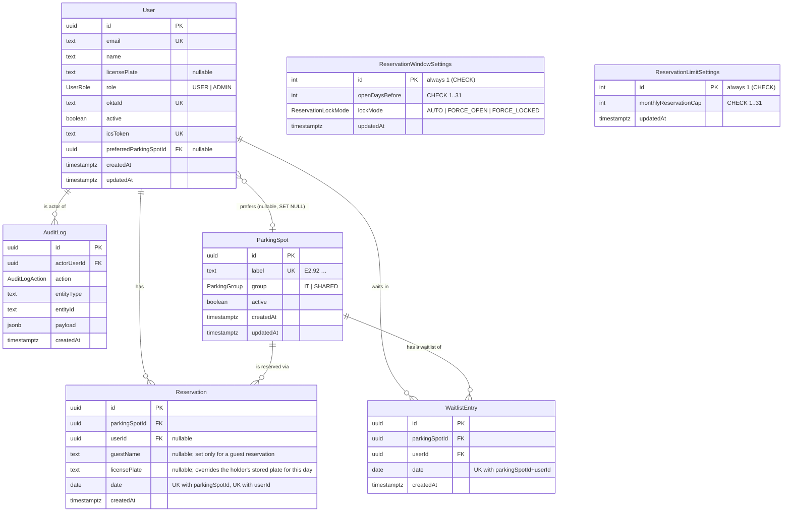

# Database – schema, migrations, seed, backups

PostgreSQL 17 + Prisma 7. Everything database-related lives in `libs/lets-park/database`
(tag `type:data`, `scope:api`); the CLI configuration is in `prisma.config.ts`
at the repo root.

The source of truth for **the shape of the data** is the contract
(`libs/lets-park/contract/src/schemas/entities.ts`). The Prisma schema mirrors it – the
same field names, the same nullability, the same enums. Where storage
differs, it's deliberate and described below in the section
[Where storage differs from the contract](#where-storage-differs-from-the-contract).

---

## Files

| file                                                      | what it's for                                                                                     |
| --------------------------------------------------------- | ------------------------------------------------------------------------------------------------- |
| `prisma.config.ts` (root)                                 | Prisma CLI configuration: the path to the schema, to migrations, `DATABASE_URL`, the seed command |
| `libs/lets-park/database/prisma/schema.prisma`            | the domain model                                                                                  |
| `libs/lets-park/database/prisma/migrations/`              | SQL migrations + `migration_lock.toml`                                                            |
| `libs/lets-park/database/src/generated/prisma/`           | the **generated** Prisma Client (committed, never hand-edited)                                    |
| `libs/lets-park/database/src/lib/create-prisma-client.ts` | the single place the client is created (the driver adapter)                                       |
| `libs/lets-park/database/src/lib/seed-data.ts`            | seed data as plain data (testable without a database)                                             |
| `libs/lets-park/database/src/scripts/seed.ts`             | the script that writes it (idempotent)                                                            |
| `libs/lets-park/database/src/index.ts`                    | the public entry point, `@lets-park/database`                                                     |

`prisma.config.ts` sits at the root because that's where the Prisma CLI looks
for configuration, and it's also where the root `.env` lives (see
`doc/decision/0009-*`). Prisma 7 no longer loads `.env` itself – hence
`import 'dotenv/config'` as the very first line of that file.

---

## ERD



`ReservationWindowSettings` and `ReservationLimitSettings` both stand off to
the side in the diagram – neither has a relationship to anything; each is a
global setting (`doc/decision/0004-*`, `doc/decision/0312-*`).

---

## Constraints the reservation logic stands on

These indexes aren't optimizations, they're **business rules enforced by the
database**. Without them, a concurrent write from two requests can produce a
double booking no matter how careful the application code is.

| constraint                                                                  | what it guarantees                                                                                                                                                                                                                                                                              |
| --------------------------------------------------------------------------- | ----------------------------------------------------------------------------------------------------------------------------------------------------------------------------------------------------------------------------------------------------------------------------------------------- |
| `Reservation (parkingSpotId, date)` UNIQUE                                  | one spot has at most one reservation per day; a violation (`P2002`) is mapped by Task 10 onto the contract error `SPOT_ALREADY_RESERVED`                                                                                                                                                        |
| `Reservation (userId, date)` UNIQUE                                         | one user has at most one reservation per day (guest reservations, with `userId` null, are exempt — a guest has no identity beyond `guestName`, so one guest name can be given every bay in the lot on one day; see `doc/decision/0305-a-reservation-holder-is-a-user-or-a-guest-never-neither`) |
| `Reservation_holder_check` CHECK                                            | `("userId" IS NULL) <> ("guestName" IS NULL)` – a reservation names exactly one holder, a user or a guest, never neither and never both (`doc/decision/0305-a-reservation-holder-is-a-user-or-a-guest-never-neither`)                                                                           |
| `WaitlistEntry (parkingSpotId, userId, date)` UNIQUE                        | can't join the same waitlist twice                                                                                                                                                                                                                                                              |
| `User.email`, `User.oktaId`, `User.icsToken` UNIQUE                         | Okta login and the ICS feed must each resolve to exactly one user; `oktaId` is the key used for provisioning                                                                                                                                                                                    |
| `ParkingSpot.label` UNIQUE                                                  | the label is the spot's natural key (and the key the seed upserts on)                                                                                                                                                                                                                           |
| `ReservationWindowSettings` `CHECK (id = 1)`                                | the singleton – see below                                                                                                                                                                                                                                                                       |
| `ReservationWindowSettings` `CHECK (openDaysBefore BETWEEN 1 AND 31)`       | mirrors `MIN_OPEN_DAYS_BEFORE`/`MAX_OPEN_DAYS_BEFORE` from the contract                                                                                                                                                                                                                         |
| `ReservationLimitSettings` `CHECK (id = 1)`                                 | a second singleton, same pattern – see below                                                                                                                                                                                                                                                    |
| `ReservationLimitSettings` `CHECK (monthlyReservationCap BETWEEN 1 AND 31)` | mirrors `MIN_MONTHLY_RESERVATION_CAP`/`MAX_MONTHLY_RESERVATION_CAP` from the contract                                                                                                                                                                                                           |
| the `AuditLog_append_only` trigger                                          | `UPDATE`/`DELETE` on `AuditLog` throws an exception                                                                                                                                                                                                                                             |
| the `AuditLog_append_only_truncate` trigger                                 | `TRUNCATE "AuditLog"` throws an exception (a row-level trigger never sees it)                                                                                                                                                                                                                   |

Additional indexes: `Reservation(date)` and `WaitlistEntry(date)` (the daily
parking-lot overview), `WaitlistEntry(parkingSpotId, date, createdAt, id)`
(who's next on the waitlist), `AuditLog(createdAt)`, `AuditLog(actorUserId)`,
`AuditLog(entityType, entityId)` (filtering in the admin UI),
`User(preferredParkingSpotId)` (so `ON DELETE SET NULL` doesn't have to
sequentially scan the whole table).

**Foreign-key behavior** is explicit everywhere, never the default:

- `User.preferredParkingSpotId` → `ON DELETE SET NULL`. A preference is a
  convenience, not a commitment: removing a spot must not delete or block the
  user.
- every other FK → `ON DELETE RESTRICT`. A user or a spot with a reservation
  or an audit record attached to it cannot be deleted; instead they're
  deactivated (`active = false`).

---

## Why the `date` column is type `DATE`

The reservation day is a calendar day in `Europe/Prague`, not an instant.
`TIMESTAMP` would anchor it to a timezone, and the day would shift depending
on the client's and the server's zone – exactly the class of bug Task 3's
work in `libs/lets-park/shared-types` addressed
(`doc/decision/0013-calendar-arithmetic-and-single-timezone-boundary.md`). In
the contract it's `z.iso.date()` (`YYYY-MM-DD`); in Postgres it's `DATE`; and
the **only** place the conversion happens is the service layer in Task 10.

Prisma types a `DATE` column as `Date` in TypeScript (UTC midnight). The test
`schema-contract-parity.spec.ts` therefore directly asserts that storage is
`Date` and the contract is `string` – so nobody passes a `Date` straight into
a contract-typed response.

---

## The `ReservationWindowSettings` singleton

The table is meant to hold **exactly one row**. Enforcement:

```sql
ALTER TABLE "ReservationWindowSettings"
  ADD CONSTRAINT "ReservationWindowSettings_singleton_check" CHECK ("id" = 1);
```

`id` is an `INTEGER` with `DEFAULT 1` and is the primary key. Together, this
means: the primary key forbids a **second** row with `id = 1`, and the `CHECK`
forbids **any other** `id`. So the table can never hold more than one row,
regardless of who writes to it – the application, `psql`, Adminer, a future
migration.

**Why not some other approach:**

- _"The application only ever writes one row."_ That's not enforcement,
  that's a habit. The first script with a bug splits the table in two, and
  reads start returning a random row.
- _A partial unique index_ (`CREATE UNIQUE INDEX … ON t ((true))`) also works,
  but it's a more obscure way of writing the same thing, and Prisma's schema
  language expresses it no better.
- _`@@unique` over a constant column_ would mean an extra column that means
  nothing.

**Why `id` isn't a UUID.** `doc/decision/0016-*` says **entity** identifiers
are UUIDs, because they travel in URLs and realtime payloads. This `id` goes
nowhere: the contract's `reservationWindowSettingsSchema` has no `id` at all —
the API reads and writes the settings with no identifier. The fixed `1` is
therefore an internal storage detail, not a violation of 0016 – and it's the
only variant where the `CHECK` can stay this trivial.

The row is created by a **migration**, not a seed (`INSERT … ON CONFLICT DO
NOTHING` at the end of `migration.sql`). The table must never be empty –
every reservation path reads it – and `prisma db seed` doesn't run in
production. The seed values still upsert it for good measure, so a
manually messed-up dev database returns to a known state.

More detail: `doc/decision/0026-singleton-settings-enforced-by-check-constraint.md`.

### `ReservationLimitSettings` is a second singleton, same pattern

`ReservationLimitSettings` — the admin-configurable monthly reservation cap,
one field, `monthlyReservationCap` — is enforced exactly the same way: a fixed
`INTEGER` primary key defaulting to `1`, a hand-written
`CHECK ("id" = 1)`, a range `CHECK` mirroring the contract's bounds
(`MIN_MONTHLY_RESERVATION_CAP`/`MAX_MONTHLY_RESERVATION_CAP`), and a seed row
inserted by its own migration's `INSERT … ON CONFLICT DO NOTHING`. It is a
**separate table from `ReservationWindowSettings`**, not a second column on it
— the window decides whether a month is open to anybody, the cap decides how
much one person may take while it is, and the two settings never had a common
identity to share in the first place. `doc/decision/0312-*` has the reasoning,
including why renaming the window model to hold both was rejected (its name is
stored as a literal string in the append-only `AuditLog`).

---

## Hard delete + `AuditLog` instead of soft delete

Cancelling a reservation **deletes the row** and writes a record into
`AuditLog`. Soft delete (`deletedAt`) is not used.

**Why:**

1. **The unique index has to hold.** `Reservation (parkingSpotId, date)` is
   the only thing preventing a double booking. With soft delete, a
   "cancelled" row would stay in the table, and the index would then block
   anyone else from taking that spot that day. This could be worked around
   with a partial index (`WHERE "deletedAt" IS NULL`), but that turns a
   simple guarantee into something every query has to remember — and
   something someone eventually forgets.
2. **Every query would have to filter.** "Who's parking today" asks about
   live reservations. Soft delete adds `WHERE "deletedAt" IS NULL` to every
   query, join, and aggregate; one forgotten spot means a silent data bug,
   not a crash.
3. **We need the history elsewhere anyway.** The audit trail has to answer
   "who, what, when, and with what payload", including for actions that
   delete no row at all (`USER_UPDATED`, `SPOT_UPDATED`, `WAITLIST_PROMOTED`).
   `AuditLog` covers all of it; soft delete covers only deletion, so a second,
   partial history would end up maintained alongside the audit log.
4. **Deletion may only be real where it's safe.** Users and spots are never
   deleted at all – they're deactivated (`active = false`), precisely so
   FKs and the audit log stay valid. Hard delete applies only to
   reservations and waitlist entries, which are short-lived, date-bounded
   records.

**That's why `AuditLog` is append-only**, and it's enforced by the database,
not by convention:

```sql
CREATE TRIGGER "AuditLog_append_only"
  BEFORE UPDATE OR DELETE ON "AuditLog"
  FOR EACH ROW EXECUTE FUNCTION "auditlog_reject_mutation"();

CREATE TRIGGER "AuditLog_append_only_truncate"
  BEFORE TRUNCATE ON "AuditLog"
  FOR EACH STATEMENT EXECUTE FUNCTION "auditlog_reject_mutation"();
```

There are deliberately two triggers: `TRUNCATE` **does not fire** row-level
triggers, so the first trigger alone would let `TRUNCATE "AuditLog";` through
and a single statement would erase the entire history. A statement-level
trigger is the only way to close that hole.

The function throws an exception with `ERRCODE = 'restrict_violation'`.
Convention wouldn't be enough here: the audit log is the only record that a
reservation ever existed at all, so an accidental `UPDATE` destroys evidence
that has nowhere to be restored from — and the table is reachable outside the
application too. The trigger stops it in every case.

The cost: a typo in `payload` can't be fixed – only a new record can be
appended. That's deliberate.

More detail: `doc/decision/0027-hard-delete-and-append-only-auditlog.md`.

---

## Where storage differs from the contract

Everything else is 1:1 (and guarded by
`libs/lets-park/database/src/lib/schema-contract-parity.spec.ts`).

| field                                        | contract (wire)                            | storage                      | why                                                                                                                                                                                                                                         |
| -------------------------------------------- | ------------------------------------------ | ---------------------------- | ------------------------------------------------------------------------------------------------------------------------------------------------------------------------------------------------------------------------------------------- |
| `AuditLog.payload`                           | `Record<string, unknown>`                  | `JSONB` (`Prisma.JsonValue`) | the payload's shape depends on `action`; a structured column would have to be a union of six shapes. `JsonValue` also allows the JSON value `null`, even though the column is `NOT NULL` – that's a property of JSON, not a nullable column |
| `Reservation.date`, `WaitlistEntry.date`     | `string` (`YYYY-MM-DD`)                    | `DATE` → `Date`              | see the section on `DATE` above                                                                                                                                                                                                             |
| `*.createdAt`, `*.updatedAt`                 | `string` (ISO 8601, `doc/decision/0015-*`) | `TIMESTAMPTZ(3)` → `Date`    | the contract is transport-neutral; the database stores an instant including the zone                                                                                                                                                        |
| `ReservationWindowSettings.id`, `.updatedAt` | doesn't exist                              | `INTEGER` / `TIMESTAMPTZ(3)` | the singleton isn't addressed through the API – see the section above                                                                                                                                                                       |
| `ReservationLimitSettings.id`, `.updatedAt`  | doesn't exist                              | `INTEGER` / `TIMESTAMPTZ(3)` | same reason, same singleton pattern                                                                                                                                                                                                         |
| `User.role`, `ParkingSpot.active`, …         | no default                                 | with `DEFAULT`               | database defaults are a safeguard; the values don't change                                                                                                                                                                                  |

Identifiers are **UUID v7** (`@default(uuid(7))`, a `UUID` column). The
contract doesn't enforce a version (`z.uuid()`, `doc/decision/0016-*`); v7 was
chosen for its monotonic prefix – writes to the primary key get better
locality than a random v4. They're generated by the Prisma Client, not the
database; a manual SQL `INSERT` therefore has to supply `id` itself (the seed
row in the migration does this too, just with a fixed `1`).
More detail: `doc/decision/0025-uuid-v7-as-primary-key.md`.

---

## How to run it

Prerequisite: `postgres` from `docker-compose.yml` is running, and there's a
root `.env` with `DATABASE_URL` (see `doc/environment.md`).

```bash
docker compose up -d postgres
cp .env.example .env      # once
```

Every command runs **from the repo root** – `prisma.config.ts` resolves the
paths into `libs/lets-park/database` itself.

| command                                | what it does                                                                                    |
| -------------------------------------- | ----------------------------------------------------------------------------------------------- |
| `npx prisma validate`                  | validates the schema (no database needed)                                                       |
| `npx prisma format`                    | formats `schema.prisma` (no database needed)                                                    |
| `npx prisma generate`                  | regenerates the client into `libs/lets-park/database/src/generated/prisma` (no database needed) |
| `npx prisma migrate dev --name <name>` | dev: creates a new migration and applies it                                                     |
| `npx prisma migrate deploy`            | production/CI: applies existing migrations, generates nothing                                   |
| `npx prisma migrate status`            | what's applied and what's missing                                                               |
| `npx prisma db seed`                   | runs `libs/lets-park/database/src/scripts/seed.ts`                                              |
| `npx prisma studio`                    | a data browser (dev)                                                                            |

A typical first run:

```bash
npx prisma migrate deploy
npx prisma db seed
```

### Trap: hand-written SQL and `migrate dev`

The end of `migration.sql` contains SQL that Prisma can't derive from the
schema (the `CHECK` constraints, the trigger, the singleton `INSERT`).
`prisma migrate dev` compares the post-migration state against
`schema.prisma`, so it sees these objects as "drift" and would propose
**dropping** them in a new migration.

The procedure for every subsequent schema change:

```bash
npx prisma migrate dev --create-only --name <name>   # only generates the SQL
# → open the generated migration.sql and delete any
#   DROP CONSTRAINT ...singleton_check / ...range_check / DROP TRIGGER
npx prisma migrate dev                                 # now apply it
```

If the hand-written SQL ever grows, an alternative is to move it into a
separate "always-run" migration; as long as it's three objects, this
procedure is cheaper than another layer of tooling.

### Seed

The seed is **idempotent** – every write is an `upsert` on a natural key
(`label`, `email`, `id = 1`), nothing is deleted. It can be run repeatedly,
even against a partially populated database.

What it creates:

- **Parking spots** matching the real layout: `E2.92`–`E2.95` (group `IT`),
  `E2.96`, `E2.65`, `E2.66`, `E2.61`, `E2.62` (group `SHARED`).
- **Dev users** `admin@example.com` (ADMIN), `user@example.com`,
  `user2@example.com`, and `inactive@example.com` (deactivated, for testing
  offboarding). The addresses are deliberately on `example.com` – nothing in
  the repo may look like a real identity (the same convention as in
  `.env.example`).
- **Reservation window settings**: `openDaysBefore = 7`, `lockMode = AUTO`.
- **Reservation limit settings**: `monthlyReservationCap = 5` — the default,
  not a floor; an admin may change it from the "Limity rezervací" tab.

Reservations and waitlist entries aren't seeded: they're bound to a date, and
by the time anyone runs the seed, they'd already be in the past.

**How to sign in as a seeded user.** `mock-oauth2-server` runs without a
mounted `JSON_CONFIG`, so its login form accepts any `sub`. The seed's
`oktaId` field is the value a developer types into that form to land on a
specific account: `dev-admin`, `dev-user`, `dev-user-2`, `dev-inactive`. Once
Task 12 adds provisioning, this will be the only link between the mock OIDC
server and the database.

---

## Backups

A single-instance deployment, no managed backup – the backup is `pg_dump`.

```bash
# full backup (custom format, compressed; best for pg_restore)
pg_dump "$DATABASE_URL" --format=custom --file=lets-park-$(date +%F).dump

# data only, no schema (migrations can restore the schema)
pg_dump "$DATABASE_URL" --format=custom --data-only --file=lets-park-data-$(date +%F).dump

# restore into an empty database (full dump, schema included)
pg_restore --dbname="$DATABASE_URL" --clean --if-exists lets-park-2026-08-28.dump

# restore data into a database where `prisma migrate deploy` has already run.
# The init migration inserted `ReservationWindowSettings (id = 1)` there itself,
# and the reservation-limits migration does the same for `ReservationLimitSettings`
# — so both rows have to be deleted first, or the backed-up settings are
# silently discarded (see below).
psql "$DATABASE_URL" -c 'DELETE FROM "ReservationWindowSettings";'
psql "$DATABASE_URL" -c 'DELETE FROM "ReservationLimitSettings";'
pg_restore --dbname="$DATABASE_URL" --data-only lets-park-data-2026-08-28.dump
```

From a running container with no local `pg_dump`:

```bash
docker compose exec -T postgres \
  sh -c 'pg_dump -U "$POSTGRES_USER" -d "$POSTGRES_DB" --format=custom' \
  > lets-park-$(date +%F).dump
```

`sh -c '…'`, in single quotes, so that `$POSTGRES_USER` and `$POSTGRES_DB` are
expanded by the **container's** shell, which is where those variables live.
Expanded by yours they are empty, and `pg_dump` then connects as the container's
own user — `FATAL: role "root" does not exist`, exit 1, a zero-byte dump. The
`$(date +%F)` stays outside the quotes: the filename is yours, not the
container's. Same trap as `docker compose exec … psql`, and the reason the
`DATABASE_URL` forms above are the ones to prefer when you have a local
`pg_dump`.

Notes:

- Restore into a database where `prisma migrate deploy` has already run, and
  use `--data-only`; otherwise `pg_restore` fights with the existing schema.
- **`ReservationWindowSettings` must be emptied before a `--data-only` restore.**
  The init migration inserts the `id = 1` singleton into it, and a `--data-only`
  restore goes through `COPY`, which has no `ON CONFLICT`. `pg_restore` merely
  reports the primary-key conflict, carries on, and exits with code 0 — so the
  backed-up `openDaysBefore` and `lockMode` are **silently discarded** and the
  database keeps the migration's defaults. Hence the `DELETE` above. Check
  afterwards with `psql "$DATABASE_URL" -c 'TABLE "ReservationWindowSettings";'`.
- The `AuditLog_append_only` trigger **does not block** a restore:
  `pg_restore` uses `INSERT`/`COPY`, not `UPDATE`. Watch out for
  `AuditLog_append_only_truncate` though: `pg_restore --data-only --clean`
  `TRUNCATE`s tables before filling them and will fail on that trigger. Either
  restore `--data-only` **without** `--clean` into an empty table, or disable the
  trigger for the duration of the restore
  (`ALTER TABLE "AuditLog" DISABLE TRIGGER "AuditLog_append_only_truncate";`,
  then `ENABLE` again when it finishes).
- The `_prisma_migrations` table is part of the dump. A full restore therefore
  also carries over the migration history, which is desirable.
