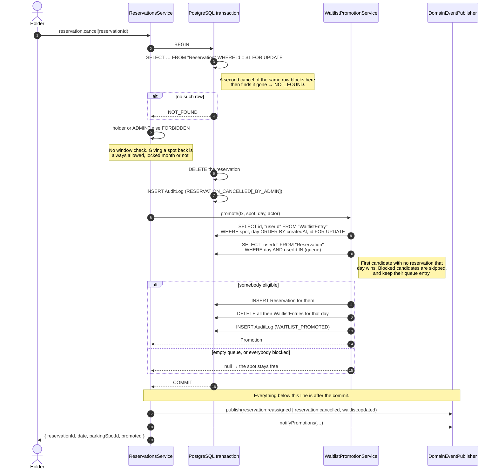

# Reservations, the waitlist and auto-promotion

`apps/garage/api/src/reservations/`. Four procedures — `reservation.create`,
`reservation.cancel`, `waitlist.join`, `waitlist.leave` — and the thing that
couples them: when a reservation is cancelled, the freed spot is handed to the
first eligible person queued for it, **inside the same transaction**.

This document is about the concurrency, because that is where the difficulty is.
The business rules are in `doc/api-modules.md` and in `plan.md`
§Byznys pravidla; the rules that decide _who may write which day_ are in
`ReservationPolicy` and summarised under [Who the window applies to](#who-the-window-applies-to).

**Bulk booking is the other half of this module and has its own document:**
[`doc/bulk-reservation.md`](./bulk-reservation.md). `reservation.confirmBulk`
can create up to a month's worth of reservations and queue entries in one
transaction, and it does it with a different set of trade-offs from the ones
below — no `FOR UPDATE`, no retry, and `ON CONFLICT DO NOTHING` instead of a
failed statement. Both paths write into the same tables and rely on the same
unique indexes, so read that one before changing anything here that touches the
queue.

---

## Cancel + promote, as a sequence



---

## Why a row lock

The queue is read with `SELECT … FOR UPDATE` through `$queryRaw`, because
Prisma's query API cannot express a row lock and the lock is the point of the
read.

It is **not** there to stop two promotions of the same cell. Two reservations for
one spot and day cannot coexist — `Reservation (parkingSpotId, date)` is unique —
so two cancellations of the same cell cannot be in flight at once.

It is there for the race against `waitlist.leave`:

|     | T1 — cancel + promote           | T2 — W1 leaves the queue      |
| --- | ------------------------------- | ----------------------------- |
| 1   | reads queue → `[W1, W2]`        |                               |
| 2   |                                 | `DELETE` W1's entry, `COMMIT` |
| 3   | `INSERT` reservation for **W1** |                               |

W1 asked to be taken out of the queue and was given a parking spot anyway.
With the lock, step 2 blocks until T1 commits and then deletes nothing, so the
`leave` answers `NOT_FOUND` — which is the truth: they were promoted before they
left. If T2 gets there first, T1's locking read never sees the row and W2 is
promoted. Both orderings are correct; without the lock the first one is not.

This is not an argument. `waitlist-concurrency.db.spec.ts` forces exactly that
interleaving with two real transactions and a barrier, and deleting `FOR UPDATE`
makes it fail with the departed waiter holding the spot.

`waitlist.join` takes the mirror-image lock — `SELECT … FOR SHARE` on the
reservation row — so that "you may only queue for an occupied spot" cannot be
decided from a row another transaction is in the middle of deleting. `FOR SHARE`
rather than `FOR UPDATE` because several people may legitimately join one queue
at once and only need to be serialised against the _deleter_.

---

## What happens under concurrency

Three rules, three mechanisms. **None of them is a check in the service.** A
read-then-write check cannot be made safe against a concurrent writer, so every
check in this table exists to produce a better error message than the index
would — never to enforce the rule.

| rule                                | enforced by                                                | the loser is told           |
| ----------------------------------- | ---------------------------------------------------------- | --------------------------- |
| one reservation per spot per day    | unique index `Reservation (parkingSpotId, date)`           | `SPOT_ALREADY_RESERVED`     |
| one reservation per user per day    | unique index `Reservation (userId, date)`                  | `RESERVATION_LIMIT_REACHED` |
| one queue entry per person per cell | unique index `WaitlistEntry (parkingSpotId, userId, date)` | `ALREADY_IN_WAITLIST`       |
| the queue is served in order, once  | `SELECT … FOR UPDATE` on the queue                         | blocks, then sees the truth |

The mapping from a violated index to a contract code lives in
`mapUniqueConstraintViolation` (`apps/garage/api/src/common/errors/prisma-error-mapping.ts`) and reads the
constraint out of `meta.driverAdapterError.cause.constraint.index`, because
`@prisma/adapter-pg` does not populate Prisma's documented `meta.target` at all.

**One exception:** `waitlist.join` _also_ throws `RESERVATION_LIMIT_REACHED`
up front when the caller already holds a reservation that day
(`WaitlistService.joinOnce`), and that check has no index behind it — joining a
queue never touches the `Reservation` table's unique index, so there is nothing
for a concurrent writer to lose against. It stays a genuine, unenforced
read-then-write check: if a reservation is acquired elsewhere in the same
instant this check passes, the join still succeeds. The consequence is benign
rather than a correctness gap — `WaitlistPromotionService.firstEligible` re-reads
eligibility at promotion time and skips a candidate who already holds a
reservation that day, so they are queued but simply never promoted, exactly as
if the up-front check had caught them. The check exists only to give that person
an honest error immediately instead of a queue position that can never resolve.

### The two failures a cancellation retries

`ReservationsService.cancel` runs its transaction up to `MAX_CANCEL_ATTEMPTS`
times. Only two errors are retried, and both come from promotion.

**`P2002` on `Reservation (userId, date)`.** The candidate acquired a reservation
elsewhere on that day between the eligibility read and the promoting insert. The
eligibility read cannot be made race-free — PostgreSQL has no predicate lock
outside `SERIALIZABLE`, and the conflicting row does not exist yet — so the index
is the arbiter and the retry is the recovery.

**`P2034`, a deadlock (`40P01`).** Two cancellations, different spots, same day,
whose queues are headed by the same person:

```
T1 (spot A)                             T2 (spot B)
FOR UPDATE on A's queue          ✓      FOR UPDATE on B's queue          ✓
INSERT reservation for W         ✓
                                        INSERT reservation for W  → waits on T1's
                                          uncommitted (userId, date) key
DELETE W's queue entries for the day
  → waits on B's queue row, held by T2
```

A cycle. PostgreSQL detects it and kills one side. This was **found by the test
suite, not by reasoning**, and no ordering of the locks _this design_ takes
removes it: a transaction cannot know which other cells it will have to reach
into until it has read its own queue, and the cross-cell `DELETE` is required by
the rule ("their other waitlist entries for that day are deleted"). An ordering
that _would_ remove it exists — locking the whole day's queue rows in canonical
order before writing — but that is the `pg_advisory_xact_lock` upgrade path
documented in `doc/decision/0065-*`, not a variant of the current locking; see
that record for the full analysis.

**Why the retry terminates.** Each attempt re-reads the queue, and by then the
reservation that caused the previous failure is committed — so the candidate that
lost is skipped by the eligibility read, and the attempt reaches for one fewer
cell than the last. With N people queued, at most N candidates can be eliminated
this way. `MAX_CANCEL_ATTEMPTS` bounds it regardless, because a bound that rests
on an argument about somebody else's code is not a bound.

**When the retry itself loses**, the caller gets `CONFLICT` — declared on
`reservation.cancel`, a 409, and the honest thing to say: they lost a race and
may try again. Reporting the underlying `RESERVATION_LIMIT_REACHED` would tell
them _they_ have a reservation-limit problem, when in fact somebody they have
never heard of does. What the service will not do is cancel without promoting: a
half-applied outcome is precisely what one transaction exists to rule out.

**The upgrade path**, if the deadlock ever becomes frequent enough to matter:
take `pg_advisory_xact_lock()` on the day at the start of every cancellation.
That serialises all promotions for one day, removes the cycle entirely, and costs
nothing at this scale — but it also serialises cancellations that have nothing to
do with each other, so it is not the default.

**The primitive is now in use elsewhere, for something narrower.** The per-user,
per-calendar-month reservation cap
(`apps/garage/api/src/reservations/monthly-reservation-cap.ts`) takes
`pg_advisory_xact_lock` on a `(userId, month)` key, because the cap is computed
rather than stored and therefore has no unique index to act as the final
arbiter — the lock plus a recount inside it _is_ the authoritative check. That is
a different key shape and a different purpose from either upgrade path described
above: it serialises one user against themselves for one month, not a day's
promotions against each other, and it does not order this file's cell locks. Both
upgrade paths above therefore remain unused.

It is not free, either. A month-scoped resource cannot be ordered against
date-scoped row locks, and the cap opened a new `confirmBulk` × `cancel` +
`promote` cycle that is resolved the same way this one is — by retrying and
reporting `CONFLICT`. See `doc/decision/0307-*` and the deadlock table in
`doc/bulk-reservation.md`.

### What is deliberately _not_ protected

A cancellation racing a `create` for the same cell needs no extra machinery. The
old reservation is still committed while the cancellation runs, so the
latecomer's insert either fails against that row or waits for the promotion to
take its place; either way the cancellation wins and the latecomer is told
`SPOT_ALREADY_RESERVED`.

---

## What happens after the commit

Nothing that can block on the network runs inside the transaction. A Slack call
or a Socket.io broadcast inside an open transaction would hold `FOR UPDATE` locks
on a cell's queue for as long as the remote end takes to answer, which turns a
slow third party into a parking lot nobody can cancel out of.

The rule is structural, not a comment: the transaction callback **returns** the
events it wants emitted, and the service publishes them after `await` has
resolved.

```ts
const outcome = await this.prisma.client.$transaction((tx) => this.cancelOnce(tx, input, actor));
// past `await`, so past COMMIT
this.publisher.publish(outcome.events);
this.publisher.notifyPromotions(outcome.notices);
```

`reservations.db.spec.ts` ("the after-commit seam") proves it rather than
asserting it: the publisher is handed a probe that reads a **second connection**,
which by definition cannot see uncommitted rows, and the test asserts that
connection already sees the promotion.

### The seam Tasks 15 and 16 fill in

`reservation-events.ts` declares `DomainEventPublisher`, an abstract class used
as the DI token. It was bound in `ReservationsModule` to
`NoopDomainEventPublisher`; both tasks below now implement it, so the binding is
`CompositeDomainEventPublisher`, which forwards to each of them in its own `try`
(`doc/decision/0135-*`).

- **Task 15 (Socket.io)** is one of the two implementations. `DomainEvent` is a mapped type
  over the contract's own `ServerToClientEvents`, so a gateway can forward one
  with `io.to(roomForDate(payload.date)).emit(name, payload)` and nothing else.
  No payload is declared here; an event not in `@garage/contract/realtime`
  does not compile.
- **Task 16 (Slack)** consumes `notifyPromotions`. Promotion is the one outcome a
  user did not ask for and would otherwise discover by refreshing the page.

Which events a committed transaction produces is the contract's decision, not
this module's:

| outcome                               | events                                              |
| ------------------------------------- | --------------------------------------------------- |
| created                               | `reservation:created`                               |
| cancelled, queue empty or all blocked | `reservation:cancelled`                             |
| cancelled, somebody promoted          | `reservation:reassigned` **and** `waitlist:updated` |
| joined / left a queue                 | `waitlist:updated`                                  |

`reservation:reassigned` **instead of** `cancelled` + `created`, never both: a
client that saw both would flash the cell empty before repainting it, and
`created` in a locked month would read as the window having been violated. See
the schema comments in `libs/garage/contract/src/realtime/events.ts`.

---

## Who the window applies to

`doc/decision/0004-*` (ruling window-1), enforced in `ReservationPolicy` — never
re-derived, since `isMonthOpen` / `monthLockState` in `@garage/shared-types`
are the only implementation of the rule.

| action                          | window applies?                               |
| ------------------------------- | --------------------------------------------- |
| create a reservation            | yes, for a normal user                        |
| join the waitlist               | yes, for a normal user                        |
| leave the waitlist              | yes — leaving reshuffles everybody behind you |
| **cancel your own reservation** | **never**                                     |
| anything, as an admin           | never                                         |
| auto-promotion                  | never — it is a system action                 |

Two rules apply to _everyone_, admin included, because they are facts about the
day rather than about the window: a day in the past (`PAST_DATE`), and a weekend
or Czech public holiday (`VALIDATION_FAILED` — see `doc/decision/0064-*`).

Bulk booking follows the same table with one difference in shape: the window is
checked **once for the whole target month** (which is why a batch may not span
two), and a weekend inside the selection is reported per day rather than
refusing the request (`doc/decision/0090-*`).

Joining a queue writes an audit row in the same transaction as the entry
(`doc/decision/0091-*`). `WAITLIST_JOINED` still means "the queued person
joined for themselves," admin-as-actor or not; an admin naming somebody else
writes `WAITLIST_JOINED_BY_ADMIN` instead, whose payload carries
`targetUserId` — mirroring the `RESERVATION_CREATED` /
`RESERVATION_CREATED_BY_ADMIN` split (`doc/decision/0306-*`). Entries are
hard-deleted on promotion or cancellation, so the log is what is left of who
asked for what.

---

## Testing

| what                               | where                                                     | how it runs          |
| ---------------------------------- | --------------------------------------------------------- | -------------------- |
| day eligibility (pure)             | `reservation-policy.spec.ts`                              | `nx run api:test`    |
| create / cancel / promote / window | `reservations.db.spec.ts`                                 | `nx run api:test-db` |
| join / leave                       | `waitlist.db.spec.ts`                                     | `nx run api:test-db` |
| the races                          | `waitlist-concurrency.db.spec.ts`                         | `nx run api:test-db` |
| bulk booking                       | `bulk-*.spec.ts` — see `doc/bulk-reservation.md` §Testing | both                 |

`api:test-db` needs `docker compose --profile dev up -d` and **does not skip**
when `DATABASE_URL` is absent — it exits 1 from `globalSetup`.

It also does not touch the developer's database. The concurrency cases have to
**commit** to race at all, an uncommitted row being invisible to the other
connection; committing means an `AuditLog` row, and `AuditLog` rejects `DELETE`
by trigger, which in turn pins the fixture users behind `ON DELETE RESTRICT`.
There is no order of deletions that empties the tables again. So the suite gets
its own database per run — created, migrated from the committed migration SQL,
and dropped — and a run killed mid-way is swept up by the next one
(`src/testing/database/test-database.ts`).

There is deliberately **no `PrismaDouble` here.** A double is the right tool for
logic made of branches; it is the wrong tool for `FOR UPDATE`, transaction
isolation and the exact shape of a `P2002`, and this project has already shipped
one defect from trusting a double about the last of those.

The two mechanisms that carry the correctness were verified by removing them:

| removed                        | result                                                                                                                                                                            |
| ------------------------------ | --------------------------------------------------------------------------------------------------------------------------------------------------------------------------------- |
| `FOR UPDATE` on the queue read | "the row lock on the queue" fails — the waiter who left is promoted                                                                                                               |
| the retry in `cancel`          | "retries and promotes the next eligible person" fails with `Unique constraint failed on the constraint: Reservation_userId_date_key`, and the parallel case fails with a deadlock |
